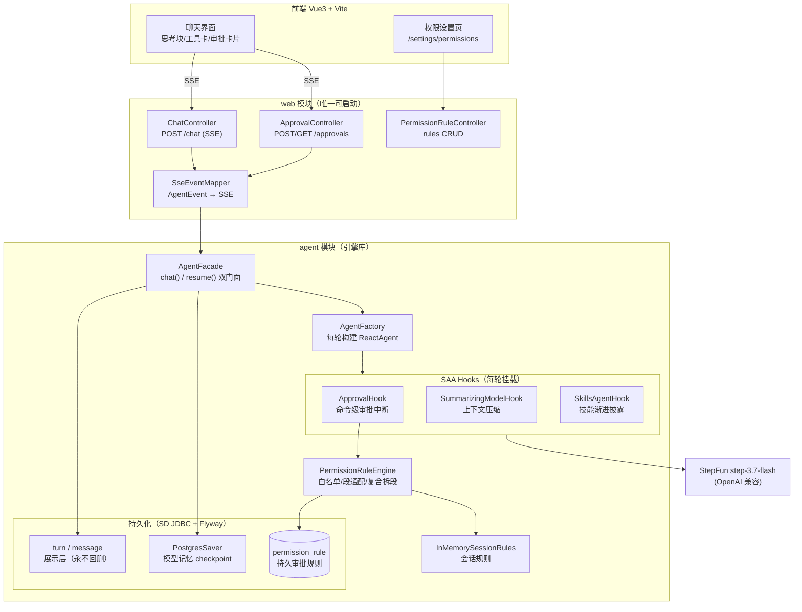
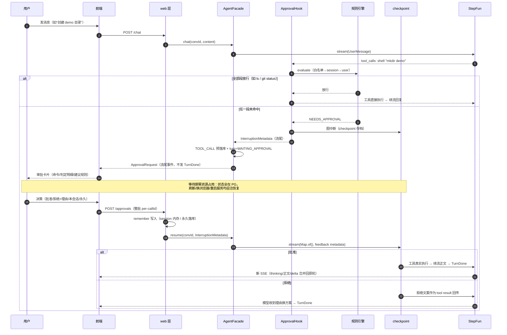

# LinAgent

基于 Spring AI Alibaba（SAA 1.1.2.3）ReactAgent 构建的多租户 ReAct Agent 服务：SSE 流式输出
（thinking / 正文 / 工具调用三类事件分离）、本地技能体系（常驻注入 + 按需渐进披露）、
hook 化上下文压缩、**命令级工具审批（HITL）**。**个人学习/实验项目，公开仅供学习参考。**

## 特性

- **流式 ReAct**：`AgentFacade.chat()` 单一门面输出 sealed 事件流——thinking 增量、正文 delta、
  工具调用/结果按 callId 关联，前端思考折叠块与工具卡片实时渲染
- **工具审批 HITL**（v0.4）：`write_file`/`shell` 调用按命令级规则判定（只读白名单/会话规则/
  持久规则），未授权则中断等待人工审批——中断态 checkpoint 持久化，刷新/重启后审批卡片与
  恢复能力完整自洽（详见下文时序图）
- **技能体系**（对标 Claude Code 机制）：`skills/` 目录下 frontmatter `resident: true` 的技能
  全文注入 system prompt 静态区；其余技能仅暴露一行描述，模型按需调 `read_skill` 加载正文
  （渐进披露），技能专属工具经 `groupedTools` 在 read 后动态暴露；清单按 name 排序保证
  字节级稳定（护住 StepFun 前缀缓存）
- **多租户工作区**（v0.2）：请求头 `x-tenant-id` / `x-user-id`，个人根
  `{workspace}/{tenant}/users/{user}` + 租户共享区符号链接；会话按 (tenant, user) 隔离
- **上下文压缩**（v0.3）：自定义 `SummarizingModelHook`（SAA `MessagesModelHook`，BEFORE_MODEL +
  `UpdatePolicy.REPLACE`），详见下文
- **持久化解耦**：给模型的记忆（PostgresSaver checkpoint）与给前端的展示（turn/message 表，
  永不回删）分离——前端历史永远完整，模型上下文按需压缩

## 上下文压缩机制（v0.3）

每次模型调用前（含轮内工具循环每一步）对真实消息列表估算 token，超阈值时：

- 阈值派生：`max-context-tokens × trigger-ratio`（默认 262,144 × 0.8，step-3.7-flash 256K 窗口
  的 80%），显式 `threshold-tokens` 优先
- 切割：保最近 `keep-turns`（默认 20）个完整 turn + 首条 UserMessage，工具调用/结果配对不拆散
- 摘要：cache-safe 调用（system prompt + 原消息字节级前缀 + 尾部压缩指令，`reasoning_effort=low`），
  复用 StepFun 前缀缓存
- 可靠性：失败/超时原样放行（错误永不进上下文）；幂等守卫拦截「被摘区仅剩旧摘要」的
  无收益重摘；摘要链式合并（早期记忆逐代承接不丢失）

## 架构



## 审批流程（v0.4 时序）



**规则引擎语义**（默认策略：只读放行、写必问）：

- 内置只读白名单（`ls/cat/grep/git status/python --version` 等 20 命令）→ 会话规则（内存）→
  持久规则（permission_rule 表，按 tenant/user 隔离）→ 审批
- `pip install *` 段通配（不匹配 `pip installx`）；复合命令按 `&&/||/;/|/\n/\r/&` 拆段，
  **全部段各自命中才放行**
- 安全加固：含重定向/`$()`/反引号/`find -delete`/`--output` 等写副作用的段丧失白名单资格
- 挂起期间新消息被 409 挡回（先决议后继续）；并发双决议由 CAS 占轮裁决

### 模块速览

- `agent/`：Agent 引擎库（ReactAgent 装配、审批、压缩、技能、工具、持久化）
- `web/`：REST + SSE 接口层（唯一可启动模块，`WebApplication`）
- `frontend/`：Vue3 + Vite + TS 聊天界面（`turn.ts` 为实时 SSE 与历史回放共用的纯逻辑层）
- `skills/`：本地技能目录（不入 jar）

## 快速开始

前置：JDK 21、Maven 3.8+、Node 18+、PostgreSQL。凭据一律走环境变量或本地配置
（`web/src/main/resources/application-local.yml`，已 gitignore，含 PG 与 StepFun 密钥）。

```bash
# 1. 建库（以你的本地 PG 用户为例）
psql -h localhost -U <你的PG用户> -d postgres -c "CREATE DATABASE linagent;"

# 2. 本地配置（不入 git）
cat > web/src/main/resources/application-local.yml <<'EOF'
spring:
  datasource:
    url: jdbc:postgresql://localhost:5432/linagent?stringtype=unspecified
    username: <你的PG用户>
    password: <你的PG密码>
  ai:
    openai:
      api-key: <StepFun API Key>
EOF

# 3. 启动
mvn install -DskipTests && mvn -pl web spring-boot:run    # 后端 :9018
cd frontend && npm install && npm run dev                  # 前端（Vite 输出端口为准，代理 /api）
```

模型默认 StepFun `step-3.7-flash`（OpenAI 兼容协议），可在配置中调整。

## 测试

```bash
mvn test                                   # 单元 + Testcontainers（manual 分组默认排除）
DB_USERNAME=... DB_PASSWORD=... mvn -pl agent test -Dtest='RepositoryTest'   # 直连本地 PG 的测试
mvn -pl agent test -Dtest=StepFunStreamingProbeTest -Dgroups=manual -Dsurefire.excludedGroups=   # 真实 API 探针
cd frontend && npx vitest run
```

`manual` 分组打真实 StepFun API（消耗配额），默认排除、需显式触发。

## 安全须知

- **shell 工具无沙箱**：`ShellTool2` 以当前用户权限在工作区内执行任意命令，模型被诱导时可
  触达用户权限范围内的系统操作。仅在本机/可信环境使用，不要把服务直接暴露到公网；
  多用户生产化前须补 shell 策略（deny-by-default）。
- **凭据不入库**：仓库不包含任何真实凭据（`application-local.yml` / `openai_key.md` 均已
  gitignore；测试配置密码走 `DB_USERNAME` / `DB_PASSWORD` 环境变量，缺省为通用占位）。

## 版本记录

| 版本 | 主题 | 要点 |
|---|---|---|
| **v0.4.0** | 工具审批（HITL） | 命令级规则引擎（白名单/双作用域规则/复合拆段/写旗标熔断）、SAA 原生中断恢复（checkpoint 持久化 + `Map.of()` resume）、ApprovalRequest 流尾事件协议、409 模态分流、前端审批卡片/权限设置页；实证并修复两个 SAA 1.1.2.3 框架缺口（自定义 hook 中断注册丢失→反射节点替换；checkpoint 续跑跳过 BEFORE_AGENT→resumePrimer） |
| **v0.3.0** | 上下文压缩 hook 化 | `SummarizingModelHook` 替换 threadId 换代体系：窗口 80% 派生阈值、turn 边界保留、cache-safe 摘要、幂等守卫；根治旧实现摘要逐轮叠加 bug |
| **v0.2.0** | 多租户 | `x-tenant-id`/`x-user-id` 身份体系、个人工作区 + 租户共享区、会话归属隔离、前端身份切换器 |
| **v0.1.0** | 初版 | ReAct + SSE 流式（thinking/正文/工具三路事件）、技能体系（常驻 + read_skill 渐进披露）、PostgresSaver 记忆、turn/message 展示层 |

## License

本项目采用 [CC BY-NC 4.0](https://creativecommons.org/licenses/by-nc/4.0/)（署名-非商业性使用
4.0 国际）许可，见 [LICENSE](LICENSE)：**允许个人学习、参考与研究使用；未经授权禁止商业使用**。
